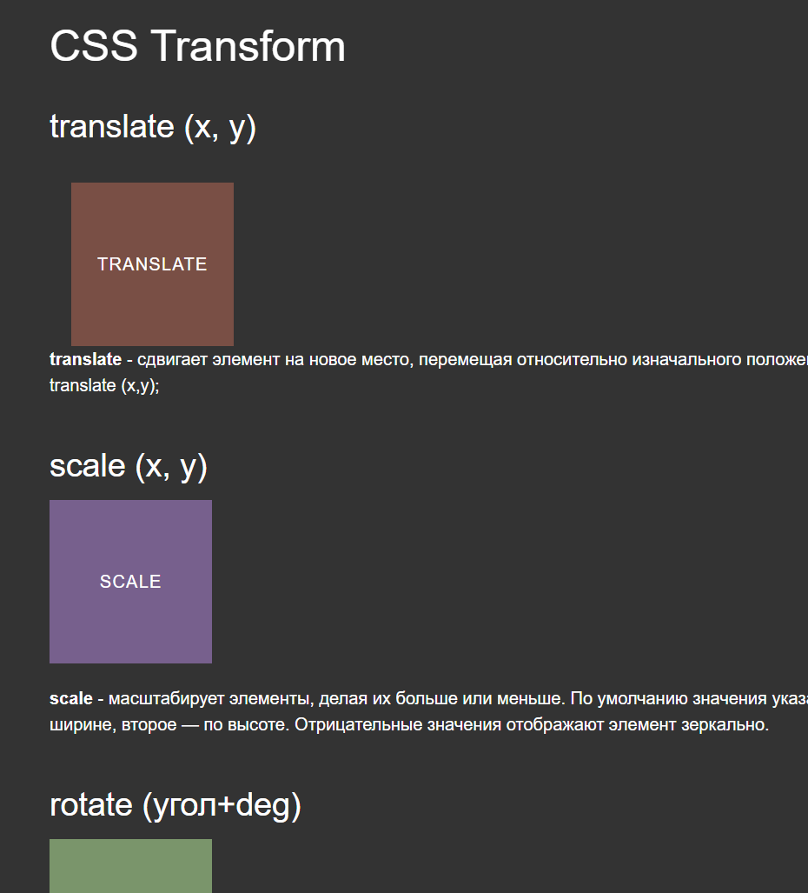
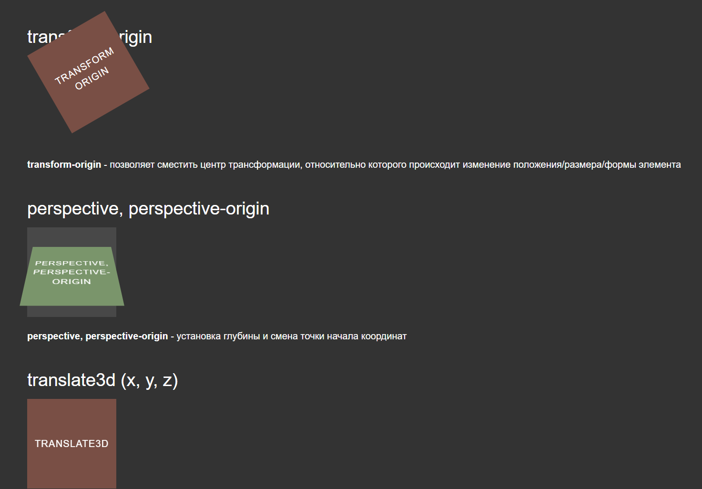

# Transition in css


`transform` в CSS предназначен для создания анимаций и трансформаций элементов веб-страницы. Это мощное свойство позволяет изменять положение, размер, вращение и другие характеристики элементов без изменения структуры HTML. С его помощью можно легко добавлять динамичные и интересные эффекты, улучшая визуальный опыт пользователей на веб-сайтах.


**Необходимые знания и инструменты для использования проекта:**

1. **Основы HTML и CSS:** Понимание структуры веб-страницы и базовых стилей.

2. **Знание свойства `transform` в CSS:** Понимание принципов применения этого свойства для трансформаций.

3. **Базовые навыки JavaScript:** Для управления и активации трансформаций через сценарии.

4. **Редактор кода:** Использование текстового редактора, такого как Visual Studio Code или Sublime Text.

5. **Браузер с поддержкой CSS3:** Обеспечивает корректное отображение и выполнение анимаций.

6. **Понимание современных стандартов браузеров:** Для обеспечения совместимости с различными браузерами.

7. **Доступ к документации CSS и браузерным инструментам разработчика:** Для более глубокого понимания возможностей и отладки.

8. **Сервер или хостинг (при необходимости):** Для развертывания и тестирования веб-страниц с применением трансформаций.

9. **Обновленный браузер:** Для оптимальной поддержки последних стандартов и функций CSS.


Процесс установки для веб-проекта, связанного с использованием свойства `transform` в CSS, обычно не включает в себя установку какого-либо программного обеспечения. Однако, **если вы хотите учесть этапы разработки и развертывания веб-проекта, вот возможные шаги:**

1. **Установка текстового редактора:**
   Выберите и установите текстовый редактор, такой как Visual Studio Code, Sublime Text или Atom.

2. **Подготовка среды разработки:**
   Откройте редактор и создайте новый проект или откройте существующий, где вы планируете использовать свойство `transform`.

3. **Создание HTML-страницы:**
   Напишите основной HTML-код вашей веб-страницы, включая необходимые элементы, которые будут подвергаться трансформациям.

4. **Добавление стилей с использованием `transform`:**
   В файле CSS добавьте стили с использованием свойства `transform` для элементов, которые вы хотите изменять.

5. **Интеграция JavaScript (при необходимости):**
   Если для управления трансформациями требуется JavaScript, добавьте соответствующий код.

6. **Тестирование на локальном сервере:**
   Запустите локальный сервер (например, с использованием расширений VS Code Live Server или Python SimpleHTTPServer) и проверьте, как работает ваш проект в браузере.

7. **Отладка и оптимизация:**
   Используйте инструменты разработчика браузера для отладки и оптимизации кода, особенно если проект включает сложные анимации.

8. **Тестирование в различных браузерах:**
   Убедитесь, что ваш проект отображается корректно в различных браузерах, учитывая особенности каждого.

9. **Развертывание на сервере (при необходимости):**
   Если вы готовы опубликовать проект, разверните его на хостинге или сервере.

Эти шаги предполагают, что вы уже имеете базовые знания веб-разработки и используете их для создания проекта с использованием свойства `transform` в CSS.

В контексте проекта, связанного с использованием свойства `transform` в CSS, установка не требуется, так как это относится к веб-разработке и применению кода на стороне клиента. Вместо этого, давайте рассмотрим, как пользователь может использовать созданный веб-проект после разработки:

1. **Интеграция в существующий проект:**
   Если у вас уже есть веб-проект, добавьте свойства `transform` в соответствующие CSS-стили элементов, которые вы хотите трансформировать.

   ```css
   .transformed-element {
     transform: translate(50px, 50px) rotate(45deg);
   }
   ```

2. **Применение анимаций:**
   Используйте `@keyframes` и свойство `animation` для создания анимаций с помощью `transform`. Пример:

   ```css
   @keyframes slideAndRotate {
     0% { transform: translateX(0); }
     50% { transform: translateX(100px) rotate(90deg); }
     100% { transform: translateX(200px); }
   }

   .animated-element {
     animation: slideAndRotate 3s ease-in-out infinite;
   }
   ```

3. **JavaScript для динамического управления:**
   Если нужно управление трансформациями через JavaScript, используйте DOM-методы или библиотеки, такие как jQuery.

   ```javascript
   // Пример использования JavaScript для изменения трансформаций
   document.getElementById('myElement').style.transform = 'scale(1.5)';
   ```

4. **Отладка с помощью инструментов разработчика:**
   Используйте инструменты разработчика браузера для отладки и проверки трансформаций во время разработки.

5. **Тестирование в различных браузерах:**
   Убедитесь, что ваш проект отображается корректно в различных браузерах.

6. **Дополнительная документация:**
   Если необходимо более подробное описание или примеры, обратитесь к документации CSS и инструкциям по использованию анимаций с помощью `transform`. Это может быть предоставлено в виде комментариев в коде, отдельного файла README или на веб-сайте проекта.

